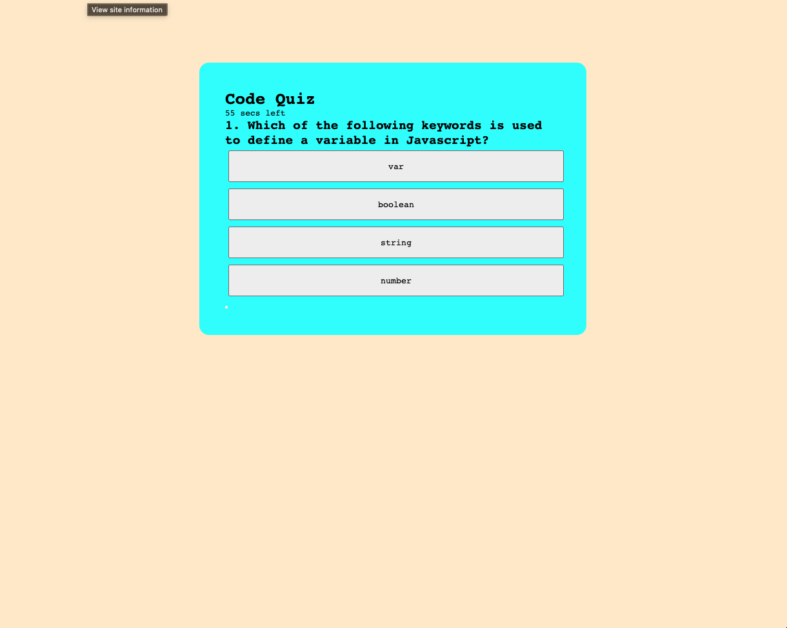
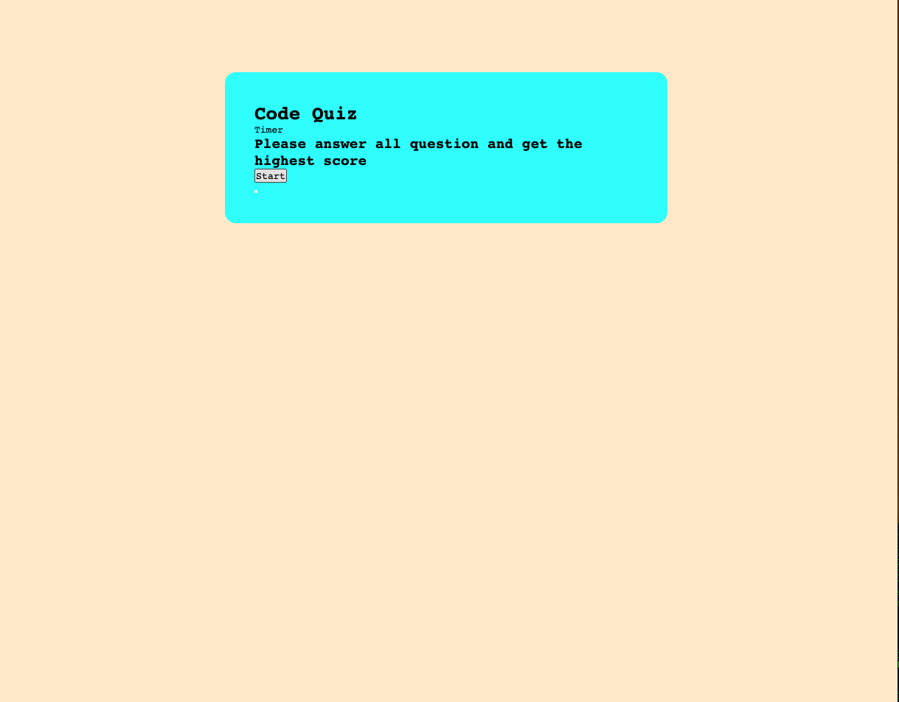

# code-quiz

https://jdiego-17.github.io/code-quiz/ 

## Technology used

I use html to set up the webpage
Used CSS to get the appearance of the web page
used Javascript to create the quiz and the functionality of the web page

## summary

Used javarscript to create a mini quiz that shows the right and work anser with a propmt of how many question are correftnand with a timer

Author
https://github.com/jdiego-17